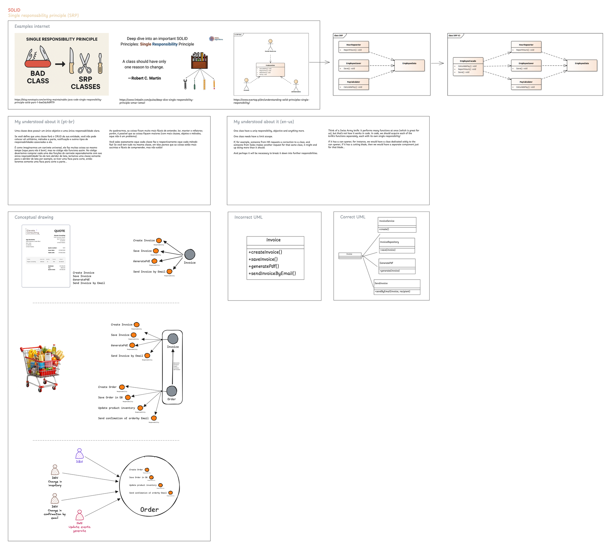
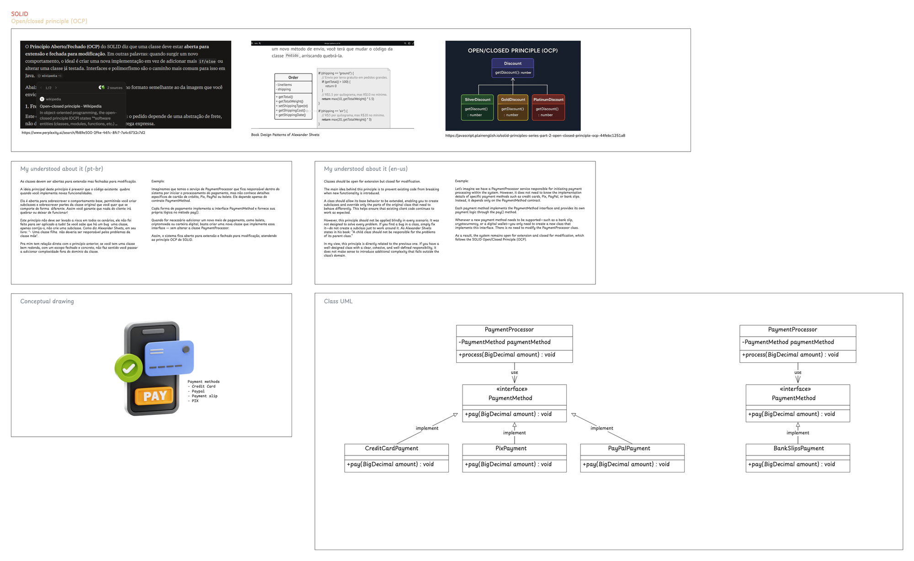
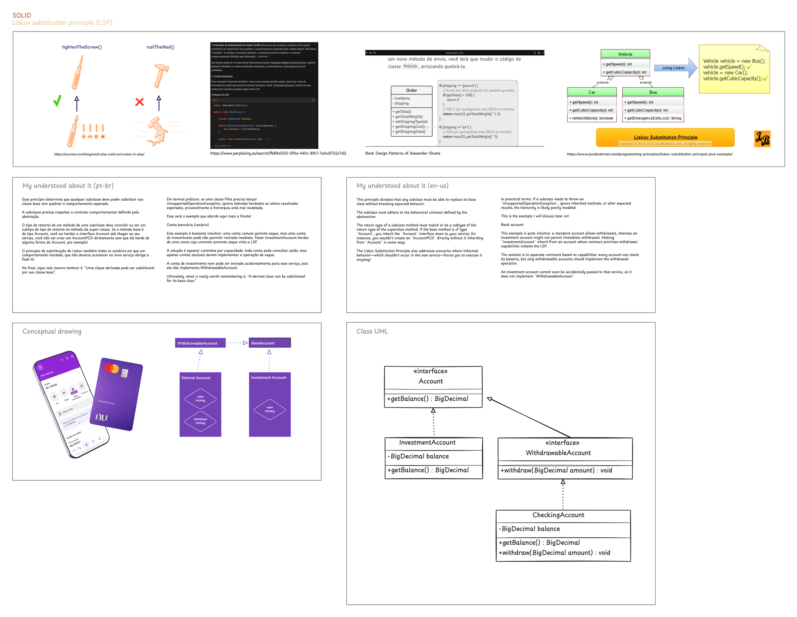
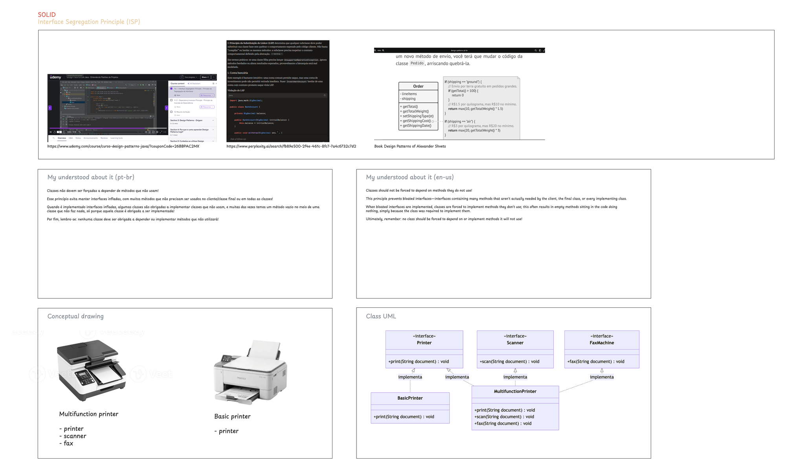
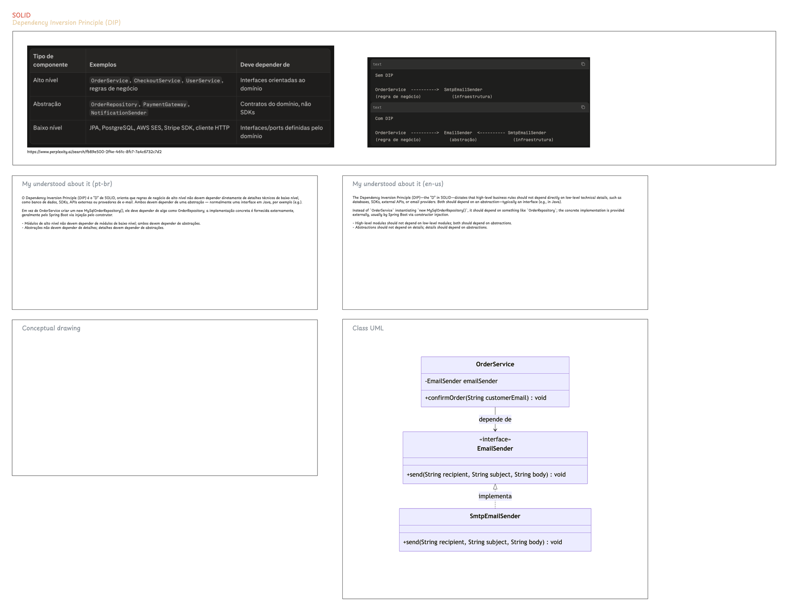

# Java Design Patterns
Java design patterns

## SOLID Principles — Visual Reference

Diagrams illustrating each SOLID principle with Java examples. Source files in [`engineering/`](engineering/) (Excalidraw).

<!-- Imagens dos diagramas — adicione abaixo -->

### SRP — Single Responsibility Principle
A class should have only one reason to change. Here, an `Invoice` that calculates totals, persists to DB, and sends emails is split into focused classes: `InvoiceCalculator`, `InvoiceRepository`, and `InvoiceSender`.



### OCP — Open/Closed Principle
Software entities should be open for extension but closed for modification. A `PaymentProcessor` accepts new payment methods (Pix, boleto, card) via strategy pattern — no existing code is touched.



### LSP — Liskov Substitution Principle
Subtypes must be substitutable for their base types without breaking behavior. An `InvestmentAccount` extends `Account` but cannot withdraw — violating LSP and causing unexpected errors at runtime.



### ISP — Interface Segregation Principle
Clients should not be forced to depend on methods they do not use. A bloated `Printer` interface with `scan()`, `fax()`, and `print()` is split into `Scannable`, `Faxable`, and `Printable`.



### DIP — Dependency Inversion Principle
High-level modules should not depend on low-level modules. Both should depend on abstractions. `OrderService` depends on a `Repository` interface, not on a concrete MySQL implementation.



> **Tip:** Open the `.excalidraw` files in [`engineering/`](engineering/) with [Excalidraw](https://excalidraw.com) or install the [Excalidraw VS Code extension](https://marketplace.visualstudio.com/items?itemName=excalidraw.excalidraw) to view and edit the diagrams interactively.

## Requisitos

- JDK 25 (LTS) — [`C:\Dev\Bins\Java\jdk-25.0.4.1`](C:\Dev\Bins\Java\jdk-25.0.4.1)

## Build and execution

```
mvn package
java -cp target\classes com.jonathas.HelloWorld
```

## Build by on specific java version by path!

```
$env:JAVA_HOME = "C:\Dev\Bins\Java\jdk-25.0.4.1"
$env:Path = "$env:JAVA_HOME\bin;$env:Path"

java --version

mvn package
java -cp target\classes com.jonathas.HelloWorld
```

## Build by specific java version on macOS!

```bash
export JAVA_HOME=$(/usr/libexec/java_home -v 25)
export PATH="$JAVA_HOME/bin:$PATH"

java --version

mvn package
java -cp target/classes com.jonathas.HelloWorld
```

> Pré-requisito: JDK 25 instalado (ex.: [Temurin](https://adoptium.net) — instala em `/Library/Java/JavaVirtualMachines/temurin-25.jdk`). Liste as versões disponíveis com `/usr/libexec/java_home -V`.

> O projeto usa [Maven Toolchains](https://maven.apache.org/plugins/maven-toolchains-plugin/): o JDK 25 precisa estar registrado em `~/.m2/toolchains.xml` (exemplo com todas as versões instaladas):
>
> ```xml
> <?xml version="1.0" encoding="UTF-8"?>
> <toolchains>
>   <toolchain>
>     <type>jdk</type>
>     <provides><version>25</version><vendor>temurin</vendor></provides>
>     <configuration>
>       <jdkHome>/Library/Java/JavaVirtualMachines/temurin-25.jdk/Contents/Home</jdkHome>
>     </configuration>
>   </toolchain>
> </toolchains>
> ```

## SOLID Content

### Single-Responsibility Principle (SRP)

`com.jonathas.HelloWorld`

### Open/Closed Principle (OCP)

`com.jonathas.HelloWorld`

### Liskov Substitution Principle (LSP)

`com.jonathas.HelloWorld`

### Interface Segregation Principle (ISP)

`com.jonathas.HelloWorld`

### Dependency Inversion Principle (DIP)

`com.jonathas.HelloWorld`